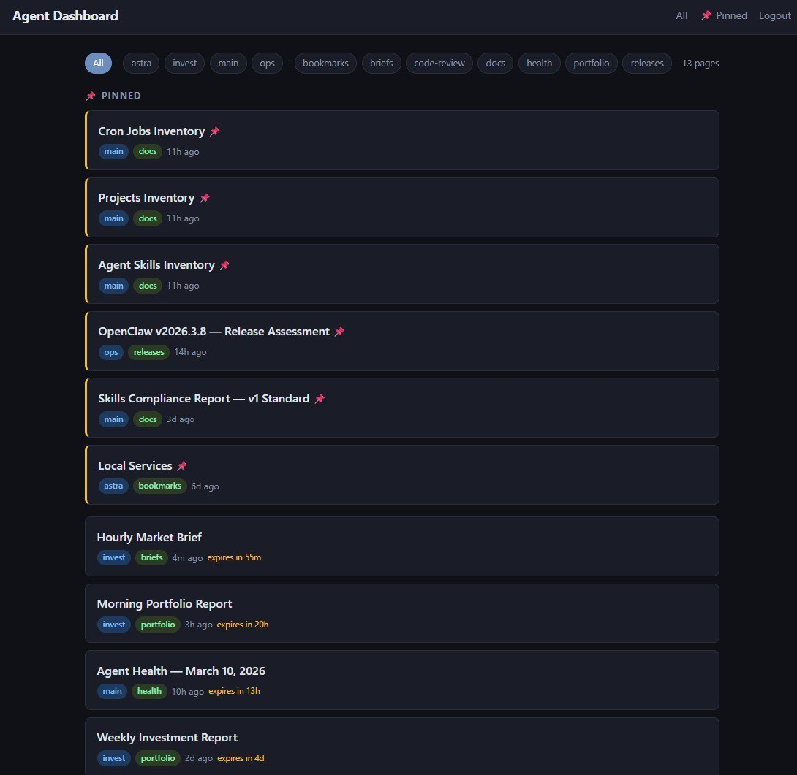
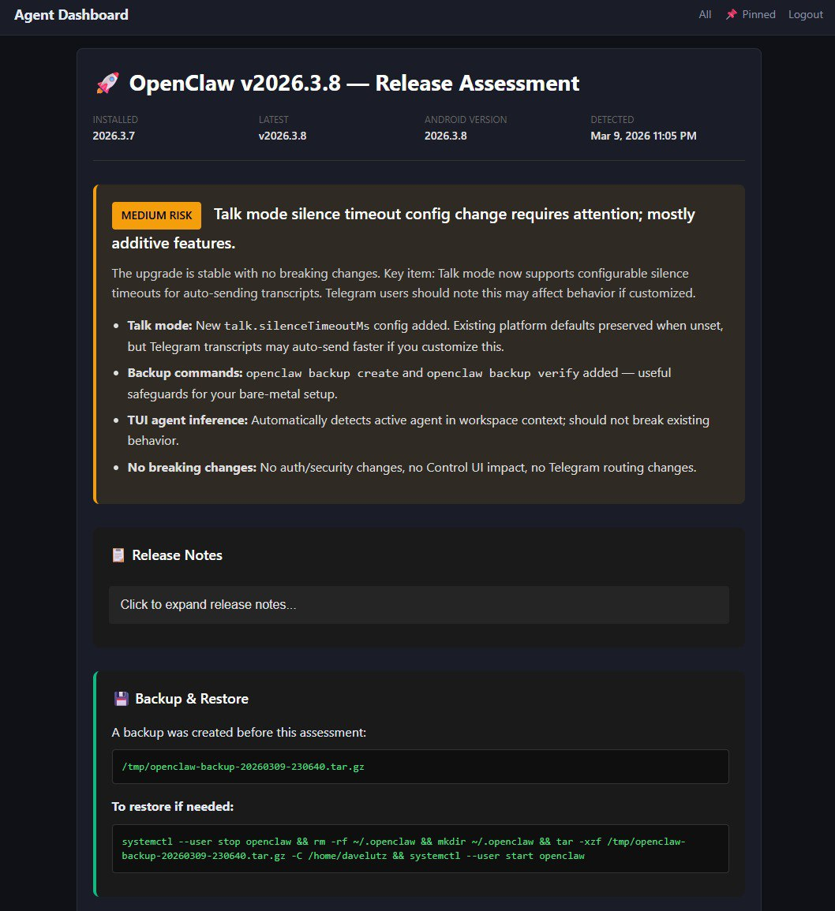

# Agent Dashboard

A lightweight web dashboard for AI agents to push rich HTML and markdown content to. Features real-time browser updates via SSE, dark mode UI, content management with TTL/pinning/categories/tags, and cookie-based auth.

Built for [OpenClaw](https://github.com/openclaw/openclaw) but works with any agent framework — it's just a REST API.

## Sample Home Page


## Sample Agent Generated Page


## Features

- **Push content via REST API** — HTML or markdown, with metadata (agent, category, tags)
- **Real-time updates** — SSE pushes changes to all open browsers instantly
- **Auto-expiring pages** — Set TTL and pages clean themselves up
- **Pinned pages** — Keep important content at the top
- **Filter by agent or category** — Multi-agent friendly
- **Cookie-based auth** — Login required for external access, auto-bypass on local network
- **SQLite storage** — Zero-config, single-file database
- **Dark mode** — Easy on the eyes, mobile-responsive

## Quick Start

```bash
git clone https://github.com/davelutztx/agent-dashboard.git
cd agent-dashboard
npm install
cp config.example.json config.json
# Edit config.json — set your token and credentials
npm start
```

Open `http://localhost:5858` in your browser.

### Use with an AI agent

Once running, your agent can push content via the API. Just tell it:

> "Push this report to the dashboard"

Or include the `skill/` directory in your agent's workspace and it'll know how to use the push script automatically. For [OpenClaw](https://github.com/openclaw/openclaw), copy `skill/` to your skills directory and set the env vars:

```bash
export DASHBOARD_URL="http://localhost:5858"
export DASHBOARD_TOKEN="your-token-from-config"
```

Any agent framework that can make HTTP requests works — it's just a REST API:

```bash
curl -X POST http://localhost:5858/api/pages/hello \
  -H "Authorization: Bearer YOUR_TOKEN" \
  -H "Content-Type: application/json" \
  -d '{"title": "Hello World", "body": "<h1>It works!</h1>"}'
```

## Configuration

Copy `config.example.json` to `config.json` and customize:

| Field | Default | Description |
|-------|---------|-------------|
| `port` | `5858` | HTTP port |
| `token` | *(auto-generated)* | Bearer token for API writes |
| `basicUser` | `admin` | Login username (for non-local access) |
| `basicPass` | `changeme` | Login password |
| `siteTitle` | `Agent Dashboard` | Displayed in header |
| `siteUrl` | `http://localhost:5858` | Public URL (used in API responses) |
| `ttlCleanupIntervalMs` | `60000` | How often to check for expired pages (ms) |
| `cookieSecret` | *(auto-generated)* | HMAC secret for session cookies |

Environment variables `PORT` and `TOKEN` override config values.

## API

### Push a page

```bash
curl -X POST http://localhost:5858/api/pages/my-report \
  -H "Authorization: Bearer YOUR_TOKEN" \
  -H "Content-Type: application/json" \
  -d '{
    "title": "Daily Report",
    "body": "<h1>Hello</h1><p>World</p>",
    "format": "html",
    "agent": "my-agent",
    "category": "reports",
    "tags": ["daily"],
    "pinned": false,
    "ttl": 86400
  }'
```

| Field | Required | Default | Description |
|-------|----------|---------|-------------|
| `title` | ✅ | — | Page title |
| `body` | ✅ | — | HTML or markdown content |
| `format` | | `html` | `html` or `markdown` |
| `agent` | | — | Agent name (for filtering) |
| `category` | | — | Category (for filtering) |
| `tags` | | — | Array of string tags |
| `pinned` | | `false` | Pin to top of index |
| `ttl` | | — | Seconds until auto-delete (`null` = permanent) |
| `replace` | | `true` | Overwrite if slug exists |

### Read pages

```
GET /api/pages              → JSON array of all pages
GET /api/pages/:slug        → JSON single page
GET /pages/:slug            → Rendered HTML (browser view)
```

### Update metadata

```bash
curl -X PATCH http://localhost:5858/api/pages/my-report \
  -H "Authorization: Bearer YOUR_TOKEN" \
  -H "Content-Type: application/json" \
  -d '{"pinned": true, "ttl": null}'
```

### Delete a page

```bash
curl -X DELETE http://localhost:5858/api/pages/my-report \
  -H "Authorization: Bearer YOUR_TOKEN"
```

### Real-time events (SSE)

```javascript
const es = new EventSource('/api/events');
es.addEventListener('push', e => console.log('New page:', JSON.parse(e.data)));
es.addEventListener('delete', e => console.log('Removed:', JSON.parse(e.data)));
```

Events: `push`, `patch`, `delete`, `expired`

## Browser Views

| Route | Description |
|-------|-------------|
| `/` | Index — all pages, filterable by agent/category |
| `/pinned` | Pinned pages only |
| `/category/:name` | Pages in a specific category |
| `/agent/:name` | Pages from a specific agent |
| `/pages/:slug` | Single page view |

All browser views auto-refresh via SSE when content changes.

## Auth

- **All API routes** (GET, POST, PATCH, DELETE) require `Authorization: Bearer <token>`
- **Browser views** require cookie-based login, **except** from local network IPs (192.168.x.x, 10.x.x.x, 172.16-31.x.x, localhost) which bypass login automatically

## Deploy as a Service

```bash
# Copy the example systemd unit
sudo cp dashboard.service /etc/systemd/system/
# Edit it — update User and WorkingDirectory
sudo systemctl daemon-reload
sudo systemctl enable --now dashboard
```

## Architecture

- **Express** — HTTP server
- **SQLite** (via better-sqlite3) — zero-config persistence
- **marked** — server-side markdown rendering
- **SSE** — real-time push to browsers (no WebSocket needed)
- **No build step** — vanilla JS + CSS, no framework

## License

MIT
